# CompanyOS

  <picture>
    <source media="(prefers-reduced-motion: reduce)" srcset="assets/hero/hero-reduced.svg">
    <source media="(prefers-color-scheme: light)" srcset="assets/hero/hero-light.svg">
    
  </picture>

  <picture>
    <source media="(prefers-reduced-motion: reduce)" srcset="assets/hero/computational-dark.svg">
    <source media="(prefers-color-scheme: light)" srcset="assets/hero/computational-light.svg">
    
  </picture>

Closed-loop AI operating system MVP for capturing meetings, customer interactions, tickets, goals, and execution metrics.

## Stack
- Next.js 16 (App Router) + TypeScript
- Tailwind CSS v4
- Prisma + SQLite
- pnpm

## Routes
- `/` product overview
- `/command` company command center ingestion
- `/dashboard` operating dashboard
- `/dashboard/runs/[id]` full run detail
- `/pricing` founder/team/enterprise pricing

## Commands
- `pnpm install`
- `pnpm dev`
- `pnpm build`
- `pnpm db:push`
